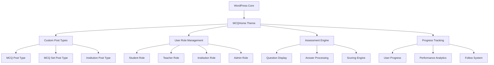

# Design Document

## Overview

The MCQHome WordPress theme is designed as a comprehensive educational platform that supports multiple user roles (Admin, Institution, Teacher, Student) with distinct capabilities and interfaces. The theme leverages WordPress's native functionality while extending it with custom post types, user roles, and specialized interfaces for MCQ management and delivery.

The design follows a modular architecture that separates concerns between user management, content creation, assessment delivery, and progress tracking. The theme prioritizes user experience with role-specific dashboards, responsive design, and performance optimization.

## Architecture

### System Architecture



### Database Schema Design

The theme extends WordPress's existing database structure with custom tables and meta fields:

**Custom Post Types:**

- `mcq` - Individual MCQ questions
- `mcq_set` - Collections of MCQs
- `institution` - Institution profiles

**Custom User Meta:**

- User role-specific profile data
- Institution associations
- Progress tracking data
- Follow relationships

**Custom Tables:**

- `mcq_attempts` - Student attempt records
- `mcq_progress` - Detailed progress tracking
- `mcq_follows` - Follow relationships between users

## Components and Interfaces

### 1. User Registration & Authentication System

**Registration Interface:**

- Role selection component (Institution, Teacher, Student)
- Dynamic form fields based on selected role
- Institution selection for teachers
- Email verification system

**Key Components:**

- `RegistrationForm` - Dynamic registration form
- `RoleSelector` - Role selection interface
- `InstitutionPicker` - Institution selection for teachers
- `ProfileSetup` - Post-registration profile completion

### 2. Dashboard System

Each user role has a specialized dashboard with role-appropriate widgets and navigation:

**Student Dashboard:**

- Enrolled courses overview
- Progress tracking widgets
- Personalized content feed
- Following management
- Performance analytics

**Teacher Dashboard:**

- Content management interface
- Student enrollment overview
- MCQ creation tools
- Performance analytics for their content
- Institution association management

**Institution Dashboard:**

- Teacher management interface
- Student enrollment overview
- Content oversight
- Institutional analytics
- Branding customization

**Admin Dashboard:**

- Platform-wide statistics
- User management
- Content moderation
- System configuration

### 3. MCQ Creation & Management System

**MCQ Builder Interface:**

- Rich text editor for questions with live preview
- WYSIWYG answer creation system:
  - Four answer fields labeled A, B, C, D
  - Radio buttons next to each option to select the correct answer
  - Real-time preview showing exactly how students will see the question
  - Inline editing with immediate visual feedback
- Explanation editor with rich text support
- Category and difficulty assignment with dropdown selectors
- Media upload support with drag-and-drop functionality
- Auto-save functionality to prevent data loss
- Preview mode that shows the exact student view

**Design Principles for MCQ Creation:**

- Visual consistency between creation and display interfaces
- Minimal clicks required to create a complete MCQ
- Immediate visual feedback for all actions
- Intuitive radio button selection for correct answers
- Real-time character counting for options
- Responsive design for creation on any device

**MCQ Set Builder:**

- MCQ selection interface
- Scoring configuration (marks per question, negative marking)
- Display format selection (next-next vs single page)
- Passing marks configuration
- Publication settings (free/paid)

### 4. Assessment Delivery System

**Question Display Formats:**

_Next-Next Format:_

- Single question per page
- Progress indicator
- Navigation controls (Previous/Next)
- Question counter
- Question navigation panel with status indicators

_Single Page Format:_

- All questions on one scrollable page
- Question navigation sidebar
- Auto-save functionality
- Submit confirmation
- Question navigation panel with status indicators

**Question Navigation Panel:**

- Grid of numbered buttons (1, 2, 3, etc.) representing each question
- Color-coded status indicators:
  - Green: Answered questions
  - Gray/White: Unanswered questions
  - Blue: Currently active question (in next-next format)
- Click-to-navigate functionality to jump to any question
- Visual progress indicator showing completion percentage
- Responsive design for mobile devices

**Answer Processing:**

- Real-time answer capture
- Auto-save functionality
- Time tracking
- Submission validation

### 5. Results & Analytics System

**Results Display:**

- Immediate score presentation
- Pass/fail status
- Detailed review option
- Performance comparison
- Progress tracking updates

**Analytics Dashboard:**

- Individual performance metrics
- Comparative analytics
- Progress over time
- Weakness identification
- Recommendation engine

### 6. Browse & Discovery System

**Content Browsing:**

- Institution directory pages
- Teacher profile pages
- Category hierarchy navigation
- Advanced filtering system
- Search functionality

**Social Features:**

- Follow/unfollow functionality
- Personalized content feeds
- Notification system
- Activity streams

## Data Models

### User Profiles

```php
// Extended user meta structure
$user_meta = [
    'user_role' => 'student|teacher|institution|admin',
    'institution_id' => 'associated_institution_id',
    'profile_data' => [
        'bio' => 'text',
        'specialization' => 'array',
        'contact_info' => 'array',
        'social_links' => 'array'
    ],
    'preferences' => [
        'notification_settings' => 'array',
        'privacy_settings' => 'array'
    ]
];
```

### MCQ Data Structure

```php
// MCQ Post Type Meta
$mcq_meta = [
    'question_text' => 'rich_text',
    'options' => [
        'A' => 'text',
        'B' => 'text',
        'C' => 'text',
        'D' => 'text'
    ],
    'correct_answer' => 'A|B|C|D',
    'explanation' => 'rich_text',
    'difficulty' => 'easy|medium|hard',
    'subject' => 'taxonomy_term',
    'topic' => 'taxonomy_term',
    'author_id' => 'user_id',
    'institution_id' => 'post_id'
];
```

### MCQ Set Configuration

```php
// MCQ Set Post Type Meta
$mcq_set_meta = [
    'mcq_ids' => 'array_of_post_ids',
    'scoring_config' => [
        'marks_per_question' => 'array',
        'negative_marking' => 'float',
        'total_marks' => 'integer',
        'passing_marks' => 'integer'
    ],
    'display_format' => 'next_next|single_page',
    'time_limit' => 'integer_minutes',
    'pricing' => [
        'type' => 'free|paid',
        'price' => 'float'
    ],
    'settings' => [
        'show_results_immediately' => 'boolean',
        'allow_retakes' => 'boolean',
        'shuffle_questions' => 'boolean'
    ]
];
```

### Progress Tracking

```php
// Progress tracking structure
$progress_data = [
    'user_id' => 'integer',
    'mcq_set_id' => 'integer',
    'attempt_data' => [
        'start_time' => 'datetime',
        'end_time' => 'datetime',
        'answers' => 'array',
        'score' => 'integer',
        'percentage' => 'float',
        'passed' => 'boolean'
    ],
    'detailed_results' => [
        'question_wise_results' => 'array',
        'time_per_question' => 'array',
        'subject_wise_performance' => 'array'
    ]
];
```

## Error Handling

### User Input Validation

- Client-side validation for immediate feedback
- Server-side validation for security
- Sanitization of all user inputs
- Rich text content filtering

### Assessment Security

- Session management for ongoing assessments
- Answer encryption during transmission
- Attempt validation and duplicate prevention
- Time limit enforcement

### Data Integrity

- Database transaction management
- Backup and recovery procedures
- Data validation at multiple levels
- Audit logging for critical operations

### User Experience Error Handling

- Graceful degradation for JavaScript failures
- Offline capability for ongoing assessments
- Auto-save functionality
- Clear error messaging and recovery options

## Testing Strategy

### Unit Testing

- Individual component testing
- Data model validation
- Scoring algorithm verification
- User role permission testing

### Integration Testing

- User registration flow testing
- Assessment delivery pipeline testing
- Progress tracking accuracy
- Cross-role interaction testing

### User Acceptance Testing

- Role-specific workflow testing
- Mobile responsiveness testing
- Performance testing under load
- Accessibility compliance testing

### Security Testing

- Authentication and authorization testing
- Input validation and sanitization
- SQL injection prevention
- Cross-site scripting (XSS) prevention

### Performance Testing

- Page load speed optimization
- Database query optimization
- Caching strategy validation
- Mobile performance testing

## Technical Implementation Details

### WordPress Integration

- Custom post types registration
- Custom taxonomies for categorization
- User role and capability management
- WordPress REST API extensions

### Frontend Technologies

- Tailwind CSS for utility-first styling and rapid development
- JavaScript for interactive components
- AJAX for seamless user experience
- Progressive Web App capabilities

### Backend Architecture

- PHP 8+ compatibility
- WordPress coding standards compliance
- Database optimization
- Caching integration (Redis/Memcached)

### Security Measures

- Nonce verification for forms
- Capability checks for all actions
- Data sanitization and validation
- Regular security updates

### Performance Optimization

- Lazy loading for images and content
- Minification of CSS and JavaScript
- Database query optimization
- CDN integration support
- Caching strategies at multiple levels
